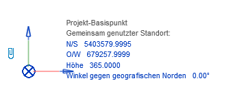
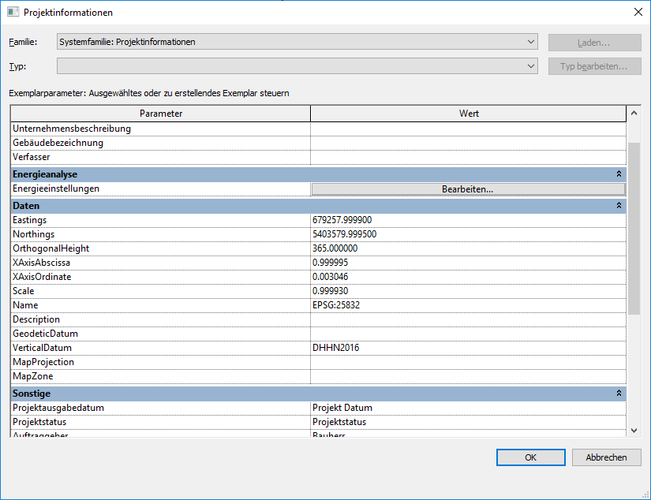
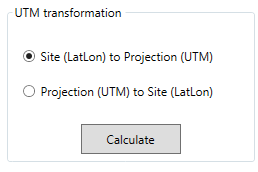
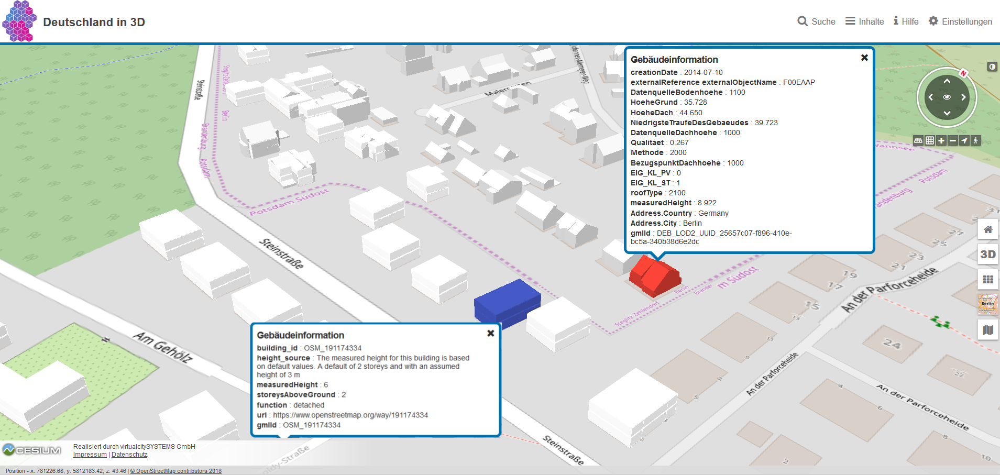
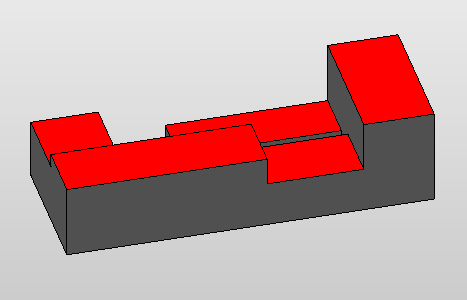
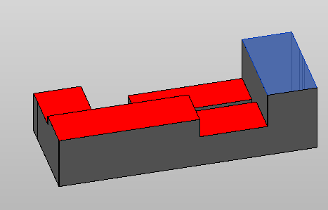
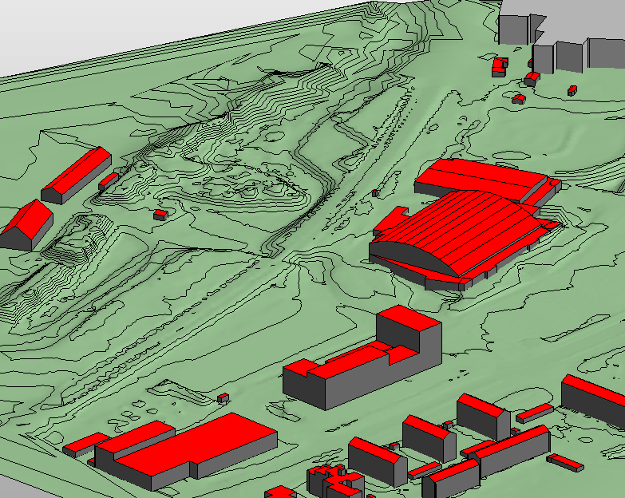
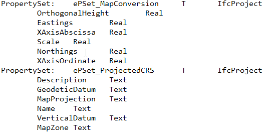
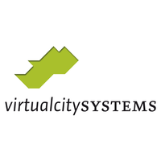

- [IFCTerrain Documentation](#ifcterrain-documentation)
  * [Terrain models in IFC](#terrain-models-in-ifc)
    + [IfcGeometricCurveSet](#ifcgeometriccurveset)
    + [IfcShellBasedSurfaceModel](#ifcshellbasedsurfacemodel)
    + [IfcTriangulatedFaceSet](#ifctriangulatedfaceset)
  * [The IFCTerrain tool](#the-ifcterrain-tool)
    + [Import settings](#import-settings)
    + [Export settings](#export-settings)
      - [IFC Version](#ifc-version)
      - [Export shape and model](#export-shape-and-model)
      - [Coordinate Origin](#coordinate-origin)
    + [Generating IFCTerrain data using command line arguments](#generating-ifcterrain-data-using-command-line-arguments)
  * [Usability of generated IFC files in other software](#usability-of-generated-ifc-files-in-other-software)
    + [Revit](#revit)
    + [Solibri](#solibri)
- [City2RVT - Plugin zum Import von amtlichen Geodaten](#city2rvt---plugin-zum-import-von-amtlichen-geodaten)
  * [Überblick](#-berblick)
  * [Installation](#installation)
    + [ohne Administratorrechte](#ohne-administratorrechte)
    + [Entwicklungsumgebung](#entwicklungsumgebung)
    + [Abhängigkeiten](#abh-ngigkeiten)
    + [Beteiligte / Kontakt / Lizenz](#beteiligte---kontakt---lizenz)
  * [Plugin-Oberfläche](#plugin-oberfl-che)
  * [Empfohlener Programmablauf](#empfohlener-programmablauf)
  * [Georeferenzierung](#georeferenzierung)
    + [Adresseingaben (Postal Address, derzeit nicht berücksichtigt)](#adresseingaben--postal-address--derzeit-nicht-ber-cksichtigt-)
    + [Baustellenkoordinate in Breite/Länge (Geographic site coordinates)](#baustellenkoordinate-in-breite-l-nge--geographic-site-coordinates-)
    + [Landeskoordinaten (Projected coordinates)](#landeskoordinaten--projected-coordinates-)
    + [Höhenangaben (Elevation)](#h-henangaben--elevation-)
    + [WGS84-UTM - Berechnung](#wgs84-utm---berechnung)
  * [Import von Stadtmodellen (City2BIM)](#import-von-stadtmodellen--city2bim-)
    + [Settings](#settings)
      - [Server-Abfrage (Server settings)](#server-abfrage--server-settings-)
        * [Einschränkungen](#einschr-nkungen)
        * [Qualität der Daten](#qualit-t-der-daten)
      - [Datei-Import (File settings)](#datei-import--file-settings-)
      - [Code-Übersetzungen (Codelist-Translation)](#code--bersetzungen--codelist-translation-)
    + [Import der Daten (Import CityModel...)](#import-der-daten--import-citymodel-)
      - [Import als Flächenmodell (...as Surfaces)](#import-als-fl-chenmodell--as-surfaces-)
      - [Import als Volumenkörper (...as Solid)](#import-als-volumenk-rper--as-solid-)
  * [Import von ALKIS-Daten (ALKIS2BIM)](#import-von-alkis-daten--alkis2bim-)
    + [Settings](#settings-1)
      - [Datei-Import (File Settings)](#datei-import--file-settings-)
      - [Texturierung auf Geländeoberfläche (Drape on Terrain)](#texturierung-auf-gel-ndeoberfl-che--drape-on-terrain-)
  * [Import von Raster-Geländemodellen (DTM2BIM)](#import-von-raster-gel-ndemodellen--dtm2bim-)
  * [IFC-Export](#ifc-export)
  * [Overview](#overview)
  * [Installation_eng](#installation-eng)
    + [Built With](#built-with)
    + [Dependencies](#dependencies)
  * [Plugin User Interface](#plugin-user-interface)
  * [Recommended workflow](#recommended-workflow)
  * [Contact](#contact)
  * [License](#license)

<!--<small><i><a href='http://ecotrust-canada.github.io/markdown-toc/'>Table of contents generated with markdown-toc</a></i></small>-->

# City2RVT - Plugin zum Import von amtlichen Geodaten

---------------------


++**[-> short english version](#overview)**
++

## Überblick


**Plugin für Autodesk Revit** zur Georeferenzierung und Verknüpfung von Geodaten in Revit.
Unterstützt wird:
- Georeferenzierung von BIM-Projekten, u.a. Berechnung von WGS84 nach UTM-Landeskoordinaten (amtliche Systeme in Deutschland)
- Import von Stadtmodellen per Serveranfrage oder dateibasiert
- Import von ALKIS (amtliches Liegenschaftskataster in Deutschland)
- Import von Raster-DGM

## Installation

Nach dem Download führen Sie die im Ordner befindliche Setup.exe aus. Das Plugin sollte automatisch installiert werden.

Bei nächsten Start von Autodesk Revit 2019 sollte das Plugin vorhanden sein. Falls beim Öffnen gefragt wird, ob das Plugin geladen werden soll, bestätigen Sie dies bitte mit *Immer laden*.

Sollte das Plugin nicht vorhanden sein, befindet sich Ihre Revit-Installation eventuell nicht im vom Setup angenommenen Ordner *[CommonAppDataFolder]\Autodesk\Revit\Addins\2019*.
Der CommonAppDataFolder ist meistens *C:\ProgramData*.

In diesem Fall muss manuell zum Addins-Ordner navigiert werden und dort die Datei *City2BIM.addin* sowie der Ordner *City2RVT* abgelegt werden.

### ohne Administratorrechte

[-> siehe hier](alternative_Installation.md)

### Entwicklungsumgebung

Das Plugin wurde mit Microsoft Visual Studio 2019 im .NET Framework in C# entwickelt.
Tests in Revit wurden größtenteils in der Version 2019 durchgeführt.

### Abhängigkeiten

Für die Programmierung wurden folgende freie API genutzt: 

- [City2BIM](https://github.com/dd-bim/City2BIM) zum Lesen der CityGml und ALKIS-Daten (im Projekt entwickelt)
- [Project Nayuki](https://www.nayuki.io/page/convex-hull-algorithm) zur Berechnung konvexer Hüllen
- [GeograpicLib](https://geographiclib.sourceforge.io/) zur Umrechnung von WGS84 (Breite/Länge) - Koordinaten in die deutschen UTM-Landessysteme der Zonen 32 und 33, Berechnung projektspezifischen Maßstabes, Berechnung Gitter-Nord 
- [Serilog](https://serilog.net/) zum Protokollieren von Log-Nachrichten
- [Revit API](https://www.revitapidocs.com/) zum Import nach Revit (proprietär, nicht in Download enthalten)

Vielen Dank an die Entwickler an dieser Stelle!

### Beteiligte / Kontakt / Lizenz

[-> siehe hier](#contributors)

## Plugin-Oberfläche

Die Funktionalitäten des Plugins sind erreichbar in der Multifunktionsleiste unterhalb des Registerkarteneintrages "City2BIM".


Sollte dieser Eintrag nicht vorhanden sein, muss geprüft werden, ob die .addin-Datei* an der richtigen Stelle liegt bzw. ob der Link in der editierbaren .addin-Datei richtig gesetzt ist ([siehe Installation](#installation)).

Die Ribbonleiste des Plugins enthält folgende Icons, dessen Funktionen im Folgenden erläutert werden:


## Empfohlener Programmablauf

Im Folgenden soll kurz beschrieben werden, wie das Plugin bestmöglich genutzt werden kann.

Vorbereitung:
- Beschaffung von relevanten Geodaten:
-- Stadtmodell-Daten im CityGML-Format (entfällt, wenn Daten von VCS-Server ausreichen)
-- ALKIS-Daten im NAS-XML-Format
-- Geländedaten als Raster-DGM (Gitterweite je nach gewünschter Genauigkeit/Realitätstreue)
- Festlegung der Projektbasispunkt-Koordinate:
-- bestenfalls in metrischen Landessystem-Koordinaten
-- alternativ: WGS84-Koordinate mit Breite/Länge ausreichend (wenn als geodätisches System ein ETRS89_UTM verwendet wird)

Programmablauf:
- Wichtig ist zunächst die **Festlegung der Georeferenzierung** duch Übergabe der Projektbasispunktkoordinate in Lage und Höhe
- anschließend können relevante Geodaten importiert werden
-- Achtung: es ist darauf zu achten, dass sämtliche Geodaten im selben Bezugssystem vorliegen
- sollen ein oder mehrere ALKIS-Themen auf dem Gelände drapiert werden, muss **vor** dem ALKIS-Import das Gelände importiert werden

## Georeferenzierung


Mithilfe der Funktionen zur Georeferenzierung wird dem Revit-Projekt eine übergeordnete (oder auch lokale) Referenzierung übergeben.
Die einzeln einzustellenden Werte haben Einfluss auf verschiedene Revit-Parameter, die im Folgenden näher erläutert werden.

Weiterführende Informationen zur Georeferenzierung in BIM und im Speziellen in IFC (Level of Georeferencing) erhalten Sie **[hier (Link zu Github)](https://github.com/dd-bim/IfcGeoRef/blob/master/Documentation_v3.md)**. 
Dort ist auch ein Tool zur Überprüfung/Änderung der Georeferenzierung in IFC-Dateien verfügbar.


### Adresseingaben (Postal Address, derzeit nicht berücksichtigt)

Derzeit ist eine Revit-interne Speicherung leider noch nicht implementiert, da Autodesk zwischen den Versionen der letzten Jahre Adressen unterschiedlich berücksichtigt. Es ist geplant in folgenden Versionen eine Speicherung der Daten Revit-intern in äquivalenten Parametern zu ermöglichen.

### Baustellenkoordinate in Breite/Länge (Geographic site coordinates)

Einfache Übergabe einer Punktreferenzierung in WGS84 im Format Breite/Länge zur groben Georeferenzierung.
Die Eingabe der Werte ändert den revit-internen Standort des Projektes, welcher auch folgendermaßen abrufbar ist:
*Verwalten -> Projektposition-Standort -> Reiter Standort*

Die eigegebenen Werte werden dort übernommen, siehe Bild:


Außerdem wird die Rotation ("True North") im Projektbasispunkt angepasst für das Revit-XY-Koordinatensystem übernommen.

Falls das Projekt nach IFC exportiert werden soll, wird diese Koordinate in das "IfcSite"-Objekt in die Attribute "RefLatitude" und "RefLongitude" geschrieben.

Die Koordinate ist die Entsprechung des Revit-Projektbasispunktes in WGS84. Sie dient außerdem beim serverbasierten Import von Stadtmodell-Daten als Referenz, von welchem Gebiet Stadtmodell-Daten abgerufen werden sollen.

### Landeskoordinaten (Projected coordinates)

Möglichkeit zur Übergabe von geodätischen (oder auch lokalen) Koordinaten für den Import von Geodaten bzw. die Speicherung einer Georeferenzierung in einem geodätischen Koordinatenreferenzsystem.
Die Eingabe/Berechnung der Werte hat folgenden Einfluss innerhalb des Revit-Projektes:
- Setzen des Projektbasispunktes (Eastings, Northings)
- Speicherung der Koordinaten sowie der Daten zu Rotation, Maßstab und EPSG-Code als Projektparameter
- Berücksichtigung des Maßstabes beim Import von Geodaten über das Plugin (der Maßstab wird "herausgerechnet", in Revit ist der Maßstab intern immer  gleich 1.000000)

Projektbasispunkt-Koordinaten, Übernahme von:
- Eastings
- Northings
- Orthometric Height
- True North (angepasst an Revit-XY)



### Höhenangaben (Elevation)

Möglichkeit zur Eingabe einer Projekthöhe sowie eines Höhenbezugssystems.
Die Eingabe/Berechnung der Werte hat folgenden Einfluss innerhalb des Revit-Projektes:
- Setzen der Projekthöhe im Projektbasispunkt
- Speicherung der Projekthöhe, des Bezugssystems als Projektparameter

Speicherung als Projektparameter, *Verwalten --> Einstellungen-Projektinformationen*:



Die Parameter werden durch das Plugin angelegt und orientieren sich daran, wie eine Georeferenzierung nach IFC übergeben werden soll. Wird später die derzeit implementierte IFC-Export Option benutzt, kann die Georeferenzierung standardkonform als IFC-PropertySet mit dem revit-eigenen IFC Exporter übergeben werden.

Die Daten sollten an dieser Stelle nicht manuell geändert werden. Die gespeicherten Werte für die Rotation in *XAxisAbscissa* und *XAxisOrdinate* beziehen sich hierbei in Vektorschreibweise umgerechneten Winkel aus Grid North. (Zu beachten ist der Unterschied zwischen True North und Grid North bspw. für Sonnenstandsanalysen).

### WGS84-UTM - Berechnung



Zusätzlich zu den Eingabemöglichkeiten bietet das Plugin die Möglichkeit aus WGS84 Landeskoordinaten zu berechnen. Dies ist z.B. hilfreich, falls (noch) keine Koordinaten im Landessystem bekannt sind. Die Berechnung ist ach in umgekehrter Reihenfolge (siehe Bild) möglich.
Folgende Parameter werden berechnet:
- Eastings, Northings aus Latitude, Longitude bzw. umgekehrt
- Grid North aus True North (sowie Longtude) bzw. umgekehrt (Berücksichtigung der Meridiankonvergenz)
- Scale, Maßstabsberechnung, abhängig von Meridian (Longitude bzw. Eastings) und Projekthöhe (Orthometric Height)

Voraussetzung:
- Wahl eines vordefinierten EPSG-Codes (entsprechen den ETRS89_UTM-Landessystemen in Zone 32 oder 33 in Deutschland)

## Import von Stadtmodellen (City2BIM)


Die City2BIM-Funktion bietet die Möglichkeit, Gebäude aus CityGml-Dateien zu importieren. In Deutschland (u.a. Ländern) werden 3D-Modelle amtlich im CityGml-Format (OGC-Standard) vorgehalten. Das Plugin bietet die Möglichkeit, Gebäude aus diesen Dateien nach Revit zu importieren.

Es werden die äußeren Begrenzungsflächen eines Gebäudes in LOD1- oder LOD2-Ausprägung (je nach Verfügbarkeit) entweder als geschlossene "wasserdichte" Volumenkörper (*...as Solids*) oder als Flächenmodelle (*...as Surfaces*) importiert.
LOD2-Daten zeichnen sich durch die Berücksichtigung der Dachform aus und sind somit z.B. für Solarpotentialanalysen wichtig.
LOD1-Daten enthalten lediglich einen in die Höhe (meist Gebäudehöhe am First) extrudierten Grundriss des Gebäudes.

Bevor Daten importiert werden können, wird empfohlen, die Settings anzupassen:

### Settings


In den Settings werden die Parameter zum Import vorgehalten:
- Datenquelle (*Source*): von Sever oder lokaler Datei
- Einstellungen zur Serverabfrage
- Einstellungen zum Dateiimport
- Übersetzung von Codierungen in der CityGML

#### Server-Abfrage (Server settings)

Über diese Möglichkeit können direkt CityGML-Daten per Server-Anfrage vom Projektpartner *virtualcitysystems* abgerufen werden.
Technisch wird dies über eine WFS (Web Feature Service)-Anfrage realisiert.
Informationen zu diesem WFS erhalten Sie [hier (GetCapabilities XML-Dokument)](https://hosting.virtualcitywfs.de/deutschland_viewer/wfs?Request=GetCapabilities&Service=WFS).

Die WFS-Abfrage benötigt folgende Parameter:
- URL des WFS (bereits hinterlegt, bei späteren Änderungen über *Edit URL* editierbar)
- Mittelpunkt des gewünschten Bereiches (als Standard ist Koordinate von Georeferenzierung gesetzt, kann über *custom* geändert werden)
- Ausdehnung des gewünschten Gebietes in Meter

Auf Wunsch kann die vom Server intern zurückgegebene CityGML-Datei auch lokal im CityGML-Format gespeichert werden. Dazu muss lediglich der Haken bei *save response to* gesetzt und im *...*-Button ein Speicherziel ausgewählt werden.

Ein Beispiel für eine Server-Antwort (Center: 51.659987, 6.964985 / Extent: 300 m):


##### Einschränkungen

- Server-Abfragen funktionieren nur auf dem Gebeit der Bundesrepublik Deutschland!
- Die Daten werden je nach Einstellung im deutschen amtlichen System **ETRS89_UTM32 (EPSG:25832)** oder **ETRS89_UTM33 (EPSG:25833)** zurückgegeben
- Die Qualität der Daten hängt vom jeweiligen Bundesland (siehe unten) ab.
- Die maximale Rückgabe an Gebäuden ist auf 2000 Gebäude begrenzt.
  Bitte beachten Sie dies, wenn der Parameter zur Ausdehnung eingegeben wird.

##### Qualität der Daten

Die vorgehaltenen Daten auf dem VCS-Server werden abhängig von der jeweiligen Gesetzgebung des jeweiligen Bundeslandes bereitgestellt.

Die Daten unterscheiden sich folgendermaßen (Stand: 01/2020):
- freie Stadtmodelle in LOD2/LOD1, Rückgabe enthält meist LOD2-Daten, Bsp.: Berlin, Hamburg, Thüringen, NRW
- freie Stadtmodelle, Beschränkung auf LOD1, Bsp. Sachsen
- keine kostenlosen Stadtmodelldaten, z.B. Bayern, Brandenburg
Hier werden freie Daten von OpenStreetMap verwendet. 
Dabei wird der in OSM gespeicherte Grundriss um jeweils 3 m pro Geschoss nach oben extrudiert.

Der Typ der Daten kann anhand der als Revit-Parameter gespeicherten *bldg: Building_ID* identifiziert werden:
- Sind eingefärbte Dachflächen enthalten? -> amtliche LOD2-Daten
- Enthält die Building_ID *OSM*? -> kostenlose (meist ungenauere) OpenStreetMap-Daten
- Treffen beide Angaben nicht zu? -> amtliche LOD1-Daten 

Einen Überblick über 3D-Stadtmodelldaten, welche vom Server bereitgestellt werden, ist möglich durch Nutzung des **[Deutschland-Viewers (Link)](https://deutschland.virtualcitymap.de/#/)** von virtualcitysystems. Durch Navigation in der Kartenanwendung in der 3D-Ansicht können Gebäude selektiert und deren Informationen angezeigt werden.

Beispiel aus dem Deutschland-Viewer:
- Stadtgrenze Berlin - Potsdam (Brandenburg)
- Selektion rot: amtliche LOD2-Daten aus Berlin mit Dachform und amtlicher ID
- Selektion blau: LOD1-Daten mit OSM-Quelle aus Brandenburg (Höhe grob geschätzt, Lagegenauigkeit ungewiss)



Sollten genauere Daten in LOD2 benötigt werden, muss in den meisten Fällen das jeweilige zuständige Landesamt kontaktiert werden. Diese stellen Stadtmodell-Daten dateibasiert gegen Entgelt zur Verfügung.

#### Datei-Import (File settings)

Liegen dem Nutzer CityGml-Daten lokal vor, z.B. aus Bestellung bei einem zuständigen Landesamt, können diese Daten auch direkt von der Festplatte importiert werden.
Dazu muss der Pfad zur Datei im *File*-Textfeld angegeben werden.

Zumeist liegen die (amtlichen) Daten in der Koordinatenreihenfolge *YXZ* vor. Sollte dies einmal nicht der Fall sein, kann die Reihenfolge auch auf *XYZ* geändert werden.

**Achtung:**
Der Datei-Import verzichtet auf eine Filterung der Daten bezüglich Projetmittelpunkt oder Ausdehnung.
Es ist daher empfehlenswert, keine zu großen CityGML-Daten (bspw. ganze Städte) zu importieren. Der Import würde in diesem Fall sehr lange dauern oder eventuell gar scheitern.

#### Code-Übersetzungen (Codelist-Translation)

Amtliche Geodaten für 3D-Stadtmodelle in Deutschland enthalten als Attributwerte oft Zahlen, welche eine Codierung von lesbaren Eigenschaften darstellen. Beispielattribute hierfür sind die Gebäudefunktion oder die Dachform.
Das Plugin bietet die Möglichkeit diese Codierungen zu übersetzen.  Dafür sollte der entsprechende Haken gesetzt und die jeweilige Codeliste (AdV oder SIG3D) ausgewählt werden. Die amtlichen deutschen Daten orientieren sich zumeist an der Codierung der AdV.

### Import der Daten (Import CityModel...)

Wurden alle nötigen Einstellungen gesetzt, kann der Import der Daten erfolgen. 
Dazu ist eine Auswahl des Geometrietyps erforderlich:

| LOD2-Gebäude | als Flächenmodelle (Surfaces) | als Voluemenkörper (Solid)
|--------|--------|
|        |        |

Unabhängig von der Auswahl werden folgende Operationen immer durchgeführt:
- Prüfung der Eingabegeometrie
-- Beseitigung doppelter Punkte
-- Beseitigung von Liniensegmenten, die keine Fläche bilden ("totes Ende")
-- keine Berücksichtigung von Polygonen, die weniger als 3 Punkte haben und die nicht denselben Anfangs- und Endpunkt haben (Polygon-Bedingung)
- Berücksichtigung der gespeicherten Attribute und deren Werte (Semantik)
-- alle Gebäudeattribute, welche im Standard definiert sind
-- alle generischen Attribute, die vom Urheber der Daten hinzugefügt worden sind (Präfix: *gen:*)
-- Adressdaten

#### Import als Flächenmodell (...as Surfaces)

Hiebei werden alle Flächen aus den CityGML-Daten mit deren Geometrie direkt importiert.

Die Flächenmodelle haben folgende exklusive Eigenschaften:
- Geometrie: minimaler Extrusionskörper (Tiefe = 1 cm)
- Kategorisierung: entsprechend Typ der CityGML-Fläche: Dach, Wand, Fundament, Allgemeines Modell (wenn nicht näher spezifiziert oder CityGML-ClosureSurface)
- zusätzliche Flächenattrbute, wenn im Datensatz vorhanden (z.B. Dachneigung oder Flächengröße)

Vorteile:
- evtl. zusätzliche Attribute
- spezifische Kategorisierung
- Flächen einzelen selektierbar bzw. manipulierbar
- bei LOD2: Import in der Regel zuverlässiger (Erfolgsquote > 98%)

Nachteile:
- Flächen sind geometrisch nicht miteinander verbunden (nur scheinbar)
- nicht "wasserdicht" (kein Volumenkörper)
- Import dauert wesentlich länger, da mehr Geometrie übertragen werden muss (jede Fläche einzeln)
- Performance des Revit-Projektes wird höher beansprucht

#### Import als Volumenkörper (...as Solid)

Hiebei werden alle Flächen aus den CityGML-Daten mit deren Geometrie direkt importiert.

Die Volumenkörper haben folgende exklusive Eigenschaften:
- Geometrie: topologisch verbundener Volumenkörper
- Kategorisierung: Umgebung
- Überführung alle CityGML-Buildings und CityGML-BuindingParts als einzelnen Körper

Vorteile:
- geringere Importdauer
- bessere Performance im Projekt
- Flächen sind miteinander verbunden (keine redundante Geometrie)
- "wasserdicht"

Nachteile:
- evtl. fehlenden Flächenattribute
- bei LOD2: Erfolgsquote in der Regel schlechter (> 90 %)
  Dies hängt allerdings maßgeblich von der Qualität der Daten ab.

Berechnung der Volumenkörper:
- Überführung der einzelnen Punktkoordinaten der Flächen in topoogische Vertices
Dies bedeutet, dass Punkte nicht mehr redundant gepeichert werden müssen und später ein geschlossener Körper generiert werden kann.
- (Neu-)berechnung der Vertices über Ebenenschnittpunktverfahren (Schnitt von 3 Ebenen)
- bei mehr als 3 Ebenen an Eckpunkt, wird versucht, eine möglichst originalgetreue Schnittberechnung durchzuführen
In seltenen Fällen kann die Berechnung und Übertragung nach Revit zu groben Ausreißern führen.
- schlägt die Berechnung fehl, sind sogenannte "Fallbacks" implementiert worden (siehe Parameter ***Kommentare***)
-- ursprüngliche LOD2-Gebäude werden als LOD1 dargestellt (Extrusion des Grundrisses um Gebäudehöhe)
-- scheitert auch dies aufgrund eines fehlerhaften Grundrisses, wird aus den Grundrisskoordinaten eine konvexe Hülle berechnet, welche dann wiederum um die Gebäudehöhe extrudiert wird

## Import von ALKIS-Daten (ALKIS2BIM)


Die ALKIS2BIM-Funktion bietet die Möglichkeit, amtliche Daten nach dem deutschen ALKIS-Schema zu importieren.
Berücksichtigt werden:
- Flurstücke mit Attributen und Eigntümer (wenn in Datei enthalten)
- Nutzungsarten ohne Attribute, aber entsprechend Thema eingefärbt
- Gebäudeumringe

Es handelt sich jeweils um 2D-Flächen, welche in einer separaten Ebene unterhalb der Projekthöhe positioniert werden. Wurde vorher mittels DTM2BIM ein Gelände erstellt, ist es außerdem möglich einen oder mehrere ALKIS-Themen auf dem Gelände auotmatisiert drapieren zu lassen.

### Settings


#### Datei-Import (File Settings)

Vor dem Import muss im Settings-Fenster der Pfad zu den ALKIS-Daten gesetzt werden. Vom Programm berücksichtigt werden ausschließlich Daten im XML-Format aus der NAS-Schnittstelle (NAS-XML).

Sollten Daten nicht in der Koordinatenreihenfolge *YXZ* vorliegen, kann dies hier auf *XYZ* geändert werden.


- Import der ALKIS-Themen: Gebäudeumringe, Nutzungsarten, Flurstücke (Reihenfolge von oben nach unten)
- Einfärbung der Nutzungsarten nach ALKIS-Objektartengruppen: Verkehr, Vegetation, Siedlung, Gewässer
- Identifizierung der Objektart der Nutzungsart (z.B. Straße, Gehölz) über Parameter *Kommentare*
- Berücksichtigung von Flurstücksdaten als Parameter
- Erstellung von 2D-Plänen für jede ALKIS-Ebene in den Grundrissen
- Kategorisierung als Unterregionen innerhalb einer Topographie-Fläche (diese dient als Referenzfläche)

Beispiel:


#### Texturierung auf Geländeoberfläche (Drape on Terrain)

Diese Funktion bietet dem Nutzer die Möglichkeit, ein oder mehrere ALKIS-Themen direkt auf das Gelände zu legen. Dies ist vor allem für visuelle Präsentationszwecke geeignet. (Bildbespiel, siehe Bild in Überblick)

**Achtung:**
- die Funktion ist (derzeit) nur aktiviert, wenn vorher über DTM2BIM ein Gelände erstellt wurde
- es ist nicht empfehlenswert, Flurstücke (*drape Parcels*) und Nutzungsarten (*drape Usage*) zusammen zu nutzen, da sich die Flächen in der Regel gegenseitig überlagern

## Import von Raster-Geländemodellen (DTM2BIM)


Das Plugin ermöglicht den Import von Digitalen Geländemodellen, welche als Raster vorliegen.
Solche Raster-DGM sind zumeist bei den jeweiligen Landesämtern in unterschiedlichen Gitterweiten verfügbar.

- Import im *txt*- oder *csv*-Format
- je kleiner die Gitterweite, desto höher die Genauigkeit, aber desto länger dauert der Import
- daher sollte aus Performance-Gründen kein zu großes Gebiet importiert werden
- Achtung: Raster-DGM enthalten keine Bruchkanten!
- Kategorisierung: Topographie
- Ein- und Ausblenden von Höhenlinien und/oder Triangulationskanten mit Revit-Mitteln möglich

Beispiel (mit Stadtmodell-Gebäuden):



## IFC-Export


Derzeit wurde (noch) kein eigener IFC-Exporter implementiert. Bitte nutzen Sie zum Export den revit-eigenen Exporter.
Es wird lediglich im lokalen Verzeichnis *C:\Users\\[username]\AppData\Local\City2BIM* eine Datei angelegt, mit welcher die Georeferenzierung standardkonfrom als PropertySet übergeben werden kann.

**Aufbau Datei:**



Die Attribute zur Georeferenzierung aus den Projektinformationen werden beim IFC-Export dadurch in die PropertySets *ePset_MapConversion* bzw. *ePset_ProjectedCRS* geschrieben.
Um dies zu gewährleisten muss beim Export diese Textdatei eingebunden werden, siehe Bild (Revit Ifc Exporter-Einstellungen):


## Overview

PlugIn for Autodesk Revit for integration of 3D-CityModels from CityGml, 2D-Surfaces from ALKIS (german standard for parcels, usage, building contours) and terrain grid data in a common global or local coordinate systems (e.g. ETRS89_UTM32). 


## Installation_eng

After the download please start the setup.exe. The plugin should be installed automatically.

By the next start of Autodesk Revit 2019 there should be the plugin available in the ribbon bar. If you will be asked whether plugin should be imported please click *Always load*.

If there is no plugin available your Revit installation is maybe not in the assumed folder:
*[CommonAppDataFolder]\Autodesk\Revit\Addins\2019*.
CommonAppDataFolder is in the most cases *C:\ProgramData*.

If so please navigate manually to the Addins folder of your installation and copy the addin-file *City2BIM.addin* and the folder *City2RVT* into the subfolder of version *2019*.

### Built With

-  .NET Framework and Visual Studio 2019

### Dependencies

- [City2BIM](https://github.com/dd-bim/City2BIM) for reading CityGml and ALIKS data
- [Project Nayuki](https://www.nayuki.io/page/convex-hull-algorithm) for Convex Hull calculation
- [GeograpicLib](https://geographiclib.sourceforge.io/) for conversion between WGS84-LatLon and UTM, scale and grid north calculation
- [Serilog](https://serilog.net/) for Logging messages
- [Revit API](https://www.revitapidocs.com/) for import to Autodesk Revit (proprietary, not included in Download)

## Plugin User Interface

Functionality of the plugin is available under the ribbon tab *City2BIM*.


If this tab is not available please check for the location of the needed .addin file and also the path to the relevant dll in the addin-file (see [Installation(eng)](#installation_eng)).

The ribbon tab includes the following icons:


## Recommended workflow

Preparation:
- Acquisition of relevant geodata
-- City Model data as CityGML-file (or use server reponse [only for Germany])
-- ALKIS data as NAS-XML (only in Germany available, German standard for the exchange of land register data) 
-- Terrain data as Grid-DTM (Digital Terrain Model)
- Definition of the project base point coordinate:
-- at best in metric national system coordinates
-- alternatively: WGS84 coordinates in Latitude/Longitude (only if geodetic system is ETRS89_UTM system)

Program workflow
- First of all, it is important to **determine the georeferencing** by input of the project base point coordinate in position and height
- then relevant geodata can be imported
-- Attention: it must be ensured that all geodata are available in the same reference system
- if one or more ALKIS themes are to be draped on the terrain, the terrain must be imported **before** the ALKIS import

##Contributors

The concept together with the tool was developed within the scope of the following sponsorship project:

**3D-Punktwolke - CityBIM **

| in association with | supported by |
|--------|--------|
|   [](https://www.virtualcitysystems.de/)     |        |


## Contact

   

**HTW Dresden**
**Fakultät Geoinformation**
Friedrich-List-Platz 1
01069 Dresden

Project head:

- Prof. Dr.-Ing. Christian Clemen (<christian.clemen@htw-dresden.de>)

Project staff:

- Hendrik Görne, M.Eng.
- Tim Kaiser, M.Eng.
- Sören Meier, M.Eng.
- Enrico Romanschek, M.Eng.

## License

This project is licensed under the MIT License:

```
Copyright (c) 2020 HTW Dresden

Permission is hereby granted, free of charge, to any person obtaining a copy
of this software and associated documentation files (the "Software"), to deal
in the Software without restriction, including without limitation the rights
to use, copy, modify, merge, publish, distribute, sublicense, and/or sell
copies of the Software, and to permit persons to whom the Software is
furnished to do so, subject to the following conditions:

The above copyright notice and this permission notice shall be included in all
copies or substantial portions of the Software.

THE SOFTWARE IS PROVIDED "AS IS", WITHOUT WARRANTY OF ANY KIND, EXPRESS OR
IMPLIED, INCLUDING BUT NOT LIMITED TO THE WARRANTIES OF MERCHANTABILITY,
FITNESS FOR A PARTICULAR PURPOSE AND NONINFRINGEMENT. IN NO EVENT SHALL THE
AUTHORS OR COPYRIGHT HOLDERS BE LIABLE FOR ANY CLAIM, DAMAGES OR OTHER
LIABILITY, WHETHER IN AN ACTION OF CONTRACT, TORT OR OTHERWISE, ARISING FROM,
OUT OF OR IN CONNECTION WITH THE SOFTWARE OR THE USE OR OTHER DEALINGS IN THE
SOFTWARE.

```