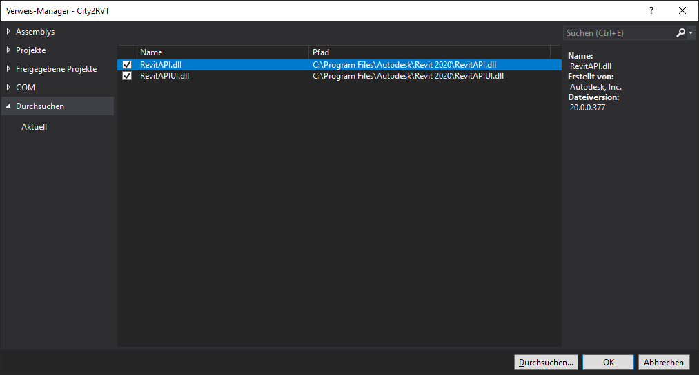

# City2RVT - Installation ohne Administratorrechte

In dieser Anleitung wird beschrieben wie Sie das Plugin "City2RVT", ohne Administratorrechte, installieren.

In der folgenden Anleitung werden jegliche Befehle/Funktionen in Visual Studio mit der deutschen Variante beschrieben.

## Voraussetzung

Visual Studio, zum Öffnen der Visual Studio Solution

## Vorgehensweise

Nach dem Download des Source Code entpacken Sie den Ordner.

### Visual Studio

Anschließend navigieren Sie in den Ordner und öffnen die darin befindliche Datei "City2BIM.sln" in Visual Studio. Ihr Projektmappen-Explorer (standardmäßig auf der echten Seite) sollte in etwa so aussehen:

Zunächst müssen Sie die Projektmappenkonfigurationen und Projektmappenplattformen ändern. Diese finden Sie in der Standard Symbolleiste:

Öffnen Sie das Dropdown Menü indem Sie den nach unten zeigenden Pfeil hinter *Debug* klicken. Hier wählen Sie den *Konfigurations-Manager...* . Im *Konfigurations-Manager* stellen Sie die *Konfiguration der aktuellen Projektmappe:* auf *Release* und die *Aktive Projektmappenplattform:* auf *x64*. Anschließend können Sie das Fenster schließen.

Im *Projektmappen-Explorer* öffnen Sie das Kontextmenü durch einen rechten Mausklick (RMK) auf das Projekt *City2BIM*. Hier wählen Sie *Neu erstellen*. Nun wird das Projekt erstellt. Diesen Vorgang wiederholen Sie für das Projekt *City2IFC". 

#### Hinweis: Sollten in den Projekten im Abschnitt *Verweise* noch gelbe Dreiecke auftauchen, liegt das wahrscheinlich an der Aktualisierung. Klicken Sie einmal einen dieser Verweise an und die gelben Dreiecke sollten verschwinden.

Navigieren Sie im Projekt *City2RVT* zum Abschnitt *Verweise*. Hier ist die Revit API mit den Verweisen *RevitAPI* und *RevitAPIUI* eingebunden. Diese müssen der Revit-Version entsprechen, welche Sie verwenden. Zurzeit ist die Revit API der Revit-Version 2019 eingebunden. Wollen Sie diese verwenden können Sie den nächsten Absatz überspringen.

Um die Revit API der Version 2020 einzubinden, müssen zunächst die Verweise *RevitAPI* und *RevitAPIUI* entfernt werden. Hierfür RMK auf diese Verweise und *Aus Projektmappe entfernen* wählen. Anschließend RMK auf *Verweise* und *Verweis hinzufügen...* wählen. Im *Verweis-Manager - City2RVT* den Button *Durchsuchen..* wählen. Nun navigieren Sie zu den Dateien *RevitAPI.dll* und *RevitAPIUI.dll* und fügen Sie hinzu. Die Dateien liegen standardmäßig unter dem Pfad: "C:\Program Files\Autodesk\Revit 2020\ *.dll". Das Ergebnis sollte folgendermaßen aussehen:

Schließen Sie den *Verweis-Manager* durch Drücken des *OK*-Buttons.

Das Projekt *City2RVT* muss nun auch erstellt werden. Dafür RMK auf das Projekt und *Neu erstellen* wählen. 

Nun sind alle Vorkehrungen in Visual Studio getroffen. Nachdem Speichern kann Visual Studio geschlossen werden.

### Explorer

Navigieren Sie im Explorer zum Plugin-Ordner und darin zur *City2RVT.dll*-Datei (Pfad: "*...\City2RVT\bin\x64\Release\City2RVT.dll*"). Kopieren Sie nun den gesamten Pfad der Datei (*Shift* + RMK -> *Als Pfad kopieren* wählen).

Öffnen Sie die Datei *City2BIM.addin* (im obersten Unterverzeichnis des Plugin Ordners) in einem Texteditor (z.B. Notepad++). In dem Assembly-Tag steht zurzeit "*City2RVT\City2RVT.dll*". Dies löschen Sie und fügen stattdessen den vorher kopierten Pfad der *City2RVT.dll*-Datei ein (Wichtig: Die Anführungszeichen "" müssen gelöscht werden). Speichern Sie die Datei und Schliesen den Editor.

Kopieren Sie die Datei *City2BIM.addin*. Geben Sie in die Sucheingabe *%appdata%* ein und öffnen den Explorer da. Navigieren Sie weiter zu dem Ordner *AppData\Roaming\Autodesk\Revit\Addins\20***. Die zwei * sind durch die jeweilige Revit-Version (19/20) zu ersetzen. In diesen Ordner fügen Sie die *City2BIM.addin* ein.

Nun ist das Plugin in Revit eingebunden. Beim Starten von Autodesk Revit sollte das Plugin vorhanden sein. Falls beim Öffnen gefragt wird, ob das Plugin geladen werden soll, bestätigen Sie dies bitte mit *Immer laden*.